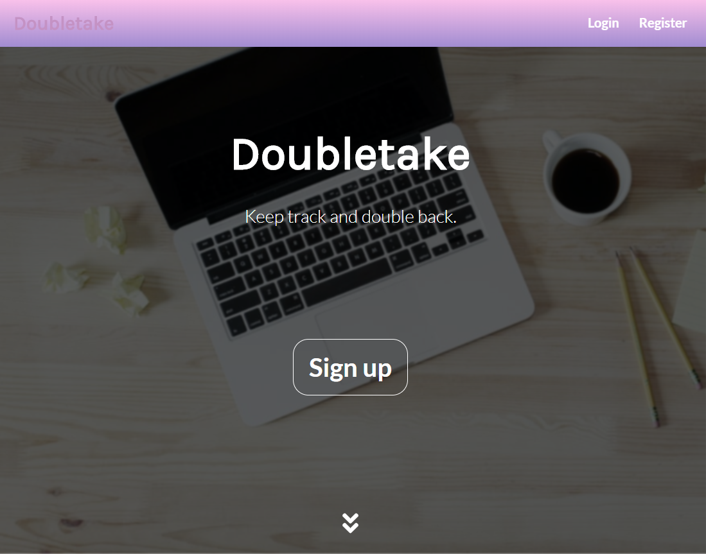
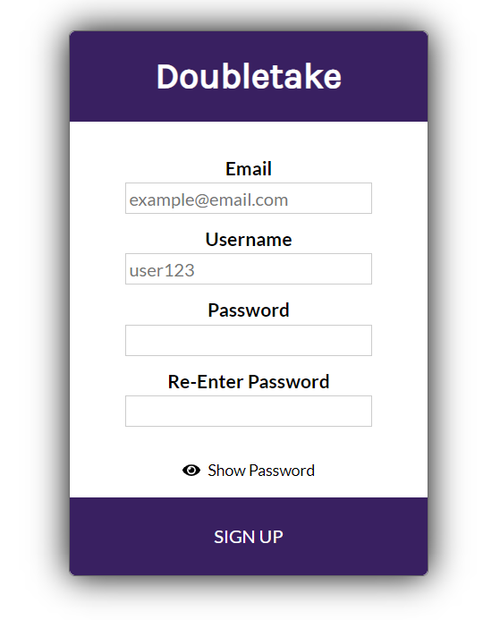
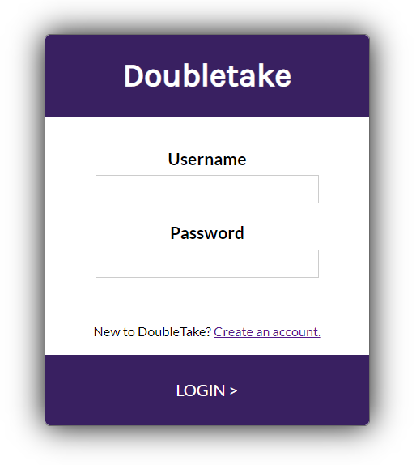
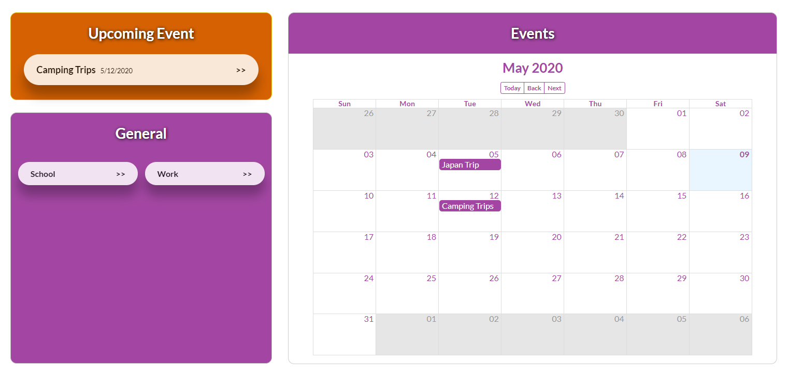
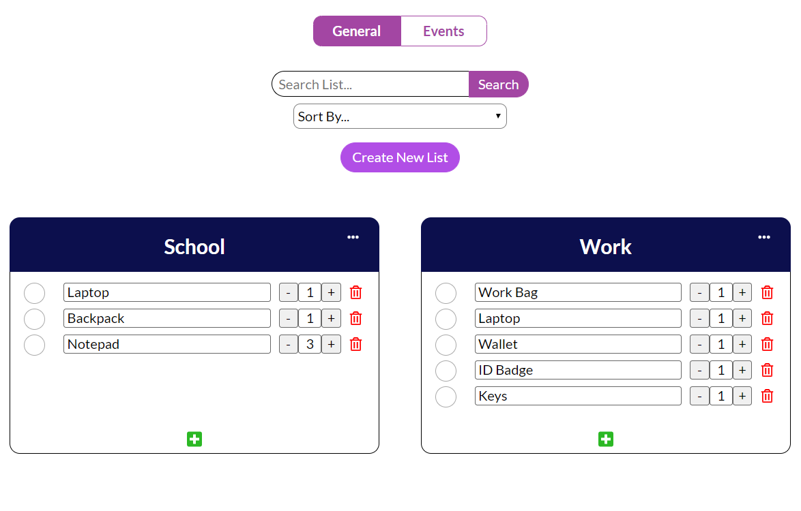
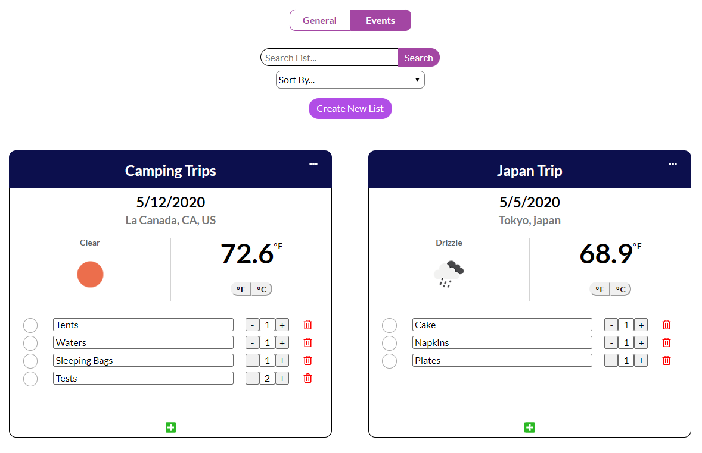

# Doubletake

* Link to live application: 
  * Demo username: testuser
  * Demo password: Password1!
 
* Link to API repository:
  * GitHub: https://github.com/wbae912/doubletake_server
  * Live link: https://doubletake-william.herokuapp.com/
  
  
## Getting Started
* Clone the repository and install dependencies using ```npm install```
* Start the development server using ```npm start```
  
  
## Description
Doubletake is a React application that serves as an item manager for users. Users are able to create two types of lists: 'General' or 'Event'. 'General lists' are used on a more regular basis, whereas 'Event lists' are for one-off occasions. Both lists allow users to add items and check them off as they pack their belongings. Additionally, users are able to toggle the quantity of items. This application also includes helpful features such as a search bar, sort options, and ability to edit, delete, or create new lists & items. The home page provides a snapshot view of all the user's lists in a convenient manner.


## Screenshots
#### Landing Page


#### Registration Page (Once user successfully creates an account they are directed to Login page)


#### Login Page (Once user successfully logs in they are directed to the Home page)


#### Home


#### General Lists


#### Event Lists



## Technologies
* HTML5
* CSS3
* ReactJS

## Dependencies Used:
* react-big-calendar
* react-loader-spinner
* react-modal
* react-scroll
* font-awesome (including @fortawesome libraries)
* moment
* jwt-decode